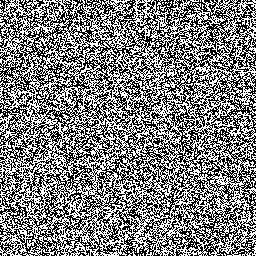

# Perfect Secrecy (50 points, 694 solves)

> Alice sent over a couple of images with sensitive information to Bob, encrypted with a pre-shared key. It is the most 
> secure encryption scheme, theoretically...

Также к заданию прикреплены 2 файла - image1.png и image2.png:

 

Описание наводит на мысль, что сообщения были закодированы при помощи одного и того же ключа. Т.к. это было самое первое
задание из этой категории, можно предположить, что использовался обычный XOR. Особо не задумываясь, я написал python 
скрипт, который XOR'ил исходные изображения и результат сохранял в result.png:

```python
from PIL import Image, ImageChops

# Open images
im1 = Image.open('./image1.png')
im2 = Image.open('./image2.png')

result = ImageChops.logical_xor(im1, im2)
result.save('result.png')
```

На выходе получили следующее изображение:


Похоже на флаг, закодированный через base64. Не проблема:

```shell script
$ echo "ZmxhZ3swbjNfdDFtM19QQGQhfQ==" | base64 -d
flag{0n3_t1m3_P@d!}
```

Флаг наш!
