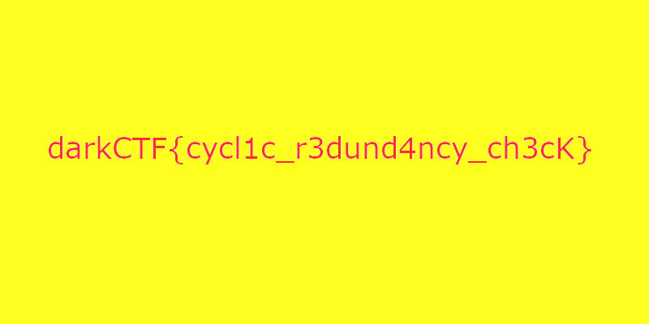

# crcket (469 points)

> DarkArmy's openers bagging as many runs as possible for our team.
>
>    1st over: 86 runs
>
>    2nd over: 37 runs
>
>    3rd over: 4 runs
>
>    4th over: 52 runs

К заданию прикреплено изображение [crcket.png](./crcket.png). Конечно же, оно "поломано". Открытие в hex-редакторе
показало, что конкретно было сломано:

Во-первых, поломаны заголовки разделов. Первый должен быть IHDR, остальные - IDAT. Более того, у нас отсутствуют
ширина и высота изображения, а также CRC. Однако в самом описании у нас есть 4 числа. Я предположил, что это 4 байта
CRC. Поэтому я перевёл их в hex и добавил в изображение. Если кому-то необходимо более подробное описание, что советую
почитать мой write-up для задания [NULL](../../../FwordCTF%202020/Misc/NULL) из FwordCTF 2020. По сути, эти задания 
практически идентичны, а там я старался описать всё максимально подробно.

Что же, заголовки исправлены, CRC на месте. Осталось найти размеры изображения. Аналогично вышеупомянутому заданию
я просто написал программу для брутфорса размеров. Итог: 800х400. Подставляем в изображение, и оно даёт нам флаг:

