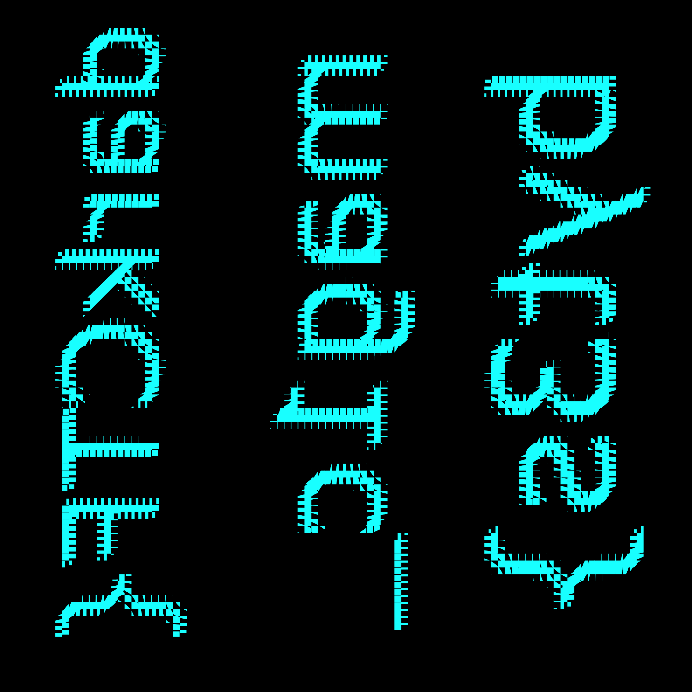

# QuickFix (449 points)

> Magic is in the air! Want a byte of it? file

К заданию прикреплён [архив](images.7z) с 10000(!) .jpg картинок, но ни одна из них не открывается. Изучение нескольких
из них в hex-редакторе показало наличие `IHDR`, `IDAT` и `IEND` заголовков, а как мы уже знаем из решения 
[crcket](../../Forensics/crcket) — эти заголовки относятся к .png изображениям. Значит необходимо исправить сигнатуру
всех файлов. Делается это нетрудно, например, так:

```python
png = b'\x89\x50\x4e\x47\x0d\x0a\x1a\x0a'
for i in range(100):
    for j in range(100):
        with open(f'./images/flag_{i}_{j}.jpg', 'rb') as inp, open(f'./images_fixed/flag_{i}_{j}.png', 'wb') as out:
            inp_b = inp.read()
            out.write(png)
            out.write(inp_b[10:])
```

Теперь картинки стали открываться без ошибок, однако не совсем ясно, что они из себя представляют. Подсказка кроется
в названиях файлов — они имеют вид `flag_x_y.png`. Очень похоже на то, что это кусочки изображения, разделённого на
100х100 частей. Что же, попробуем склеить:

```python
img_v = []
for i in range(100):
    img_h = []
    for j in range(100):
        img_h.append(imread(f'./images_fixed/flag_{i}_{j}.png'))
    img_v.append(hconcat(img_h))
imwrite('./out.png', vconcat(img_v))
```

Я воспользовался функциями из библиотеки [OpenCV](https://docs.opencv.org/master/d6/d00/tutorial_py_root.html).
Выходное изображение выглядит так:



Теперь его можно повернуть и отзеркалить, но мне было лень, ибо флаг и так читаемый:

```
darkCTF{mag1c_byt3s}
```