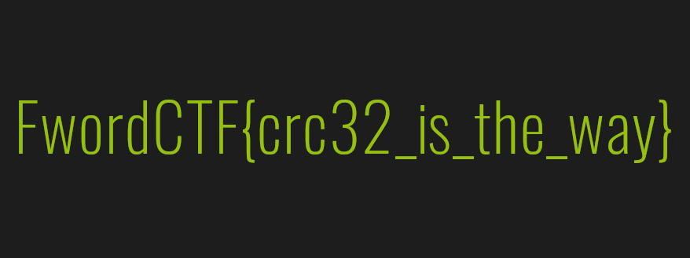

# NULL (479 points, 45 solves)

> Recover it!

В приложениях также лежит файл [NULL](./NULL).

Что же, откровенно говоря, информации о файле немного. `file NULL` возвращает неинформативное "NULL: data".
В таких случаях обычно прибегают к изучению файла в hex editor'е. Использовать можно любой привычный, я взял
[HexEd.it](https://hexed.it/). Открываем файл и смотрим на сигнатуру:


Что же, похоже, перед нами "испорченный" .png файл. Для его восстановления откроем информацию о строении PNG
файлов. Поиск в Яндексе по запросу `png file structure` выводит на вот 
[эту страницу](https://blog.underpowered.net/how-does-it-work/png-deflate/) и официальную 
[спецификацию](http://www.libpng.org/pub/png/spec/1.2/PNG-Structure.html). Отсюда видим, что корректная сигнатура — 
`89 50 4E 47 0D 0A 1A 0A`, т.е. надо изменить первый байт с `69` на `89`. На самом деле, чтобы было проще, я просто
открыл случайную .png картинку и сравнивал её состав с нашей:


Несложно заметить, что IHDR чанк прописан неверно — меняем `69 68 64 72` на `49 48 44 52` (`ihdr` -> `IHDR`). А вот что
интересно: в нашем файле дальше сплошные нули, а в "нормальной" картинке — нет. Вернёмся к составу .png файлов и выясним,
как устроены чанки и что хранится в IHDR:
```
Каждый чанк состоит из следующих обязательных частей:
1. Length — информация о длине чанка. Нужна для того, чтобы декодер знал, когда заканчивается тот или иной чанк. Записывается при помощи 4 байт.
2. Chunk type — тип чанка. У каждого из них есть своё собственное предназначение, поэтому программа интерпретирует их по-разному. 4 байта.
3. Chunk data — непосредственно данные, которые содержит чанк. Длина зависит от того, что было указано в поле Length. Может быть пустым.
4. CRC — контрольная сумма Length и Chunk type, высчитанная при помощи алгоритма CRC-32. 4 байта.

...

IHDR
Это самый первый из обязательных чанков. Важно запомнить, что он должен располагаться в самом начале документа. Состоит из 13 байт:
4 байта — ширина изображения
4 байта — высота изображения
1 байт — глубина цвета (bit depth)
1 байт — цветовая модель (color type)
1 байт — метод сжатия
1 байт — метод фильтрации
1 байт — метод чересстрочной развертки
```

Ага, значит у нас проблемы с Chunk Data, а если быть точнее с первыми 8ью байтами, т.е. с шириной и высотой
изображения. Что же делать? Вновь посмотрим на структуру чанков и увидим важное поле — CRC32. Это контрольная сумма,
рассчитанная по контенту чанка, **включая** его тип (в нашем случае `49 48 44 52` — IHDR), но **исключая** его длину
(т.е. `0D`). Итого, данная контрольная сумма рассчитывается по `13+4=17` байтам (длина + имя чанка). К сожалению,
просто так CRC не заревёрсить, т.е. найти исходные данные по выходным мы не сможем. Как же быть? Что же, никто
не мешает нам просто пройтись перебором, т.е. забрутфорсить. В принципе, логично предположить, что размеры изображения
не очень большие, поэтому я ограничил ширину и высоту до 2000 пикселей. Скрипт получился очень простым:
```python
import binascii

ihdr_start = bytearray(b'\x49\x48\x44\x52')
ihdr_end = bytearray(b'\x08\x06\x00\x00\x00')
crc32 = 0xe3677ec0
for w in range(2000):
    for h in range(2000):
        ihdr = ihdr_start + w.to_bytes(4, 'big') + h.to_bytes(4, 'big') + ihdr_end
        if binascii.crc32(ihdr) == crc32:
            print(w, h)
            exit(0)
```

На выходе получаем заветные 0x36e (ширина) и 0x149 (высота) и добавляем их обратно в наш файл (не забудьте, что эти
значения имеют длину 4 байта, т.е. `0x36e=0x0000036e` и `0x149=0x00000149`). После этого он принимает 
финальный вид:


Сохраняем его и получаем флаг:

